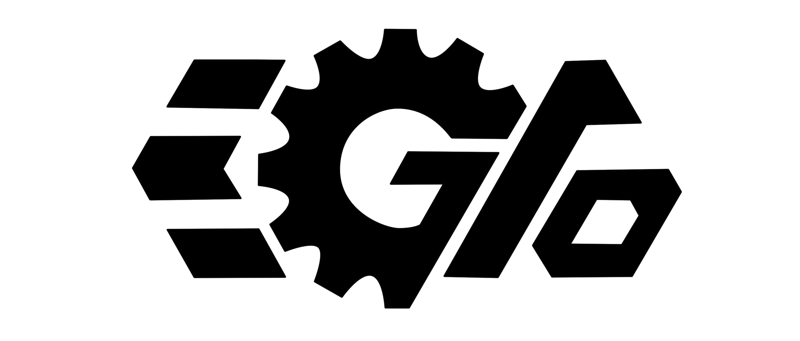
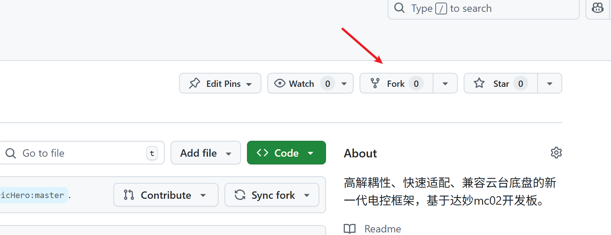
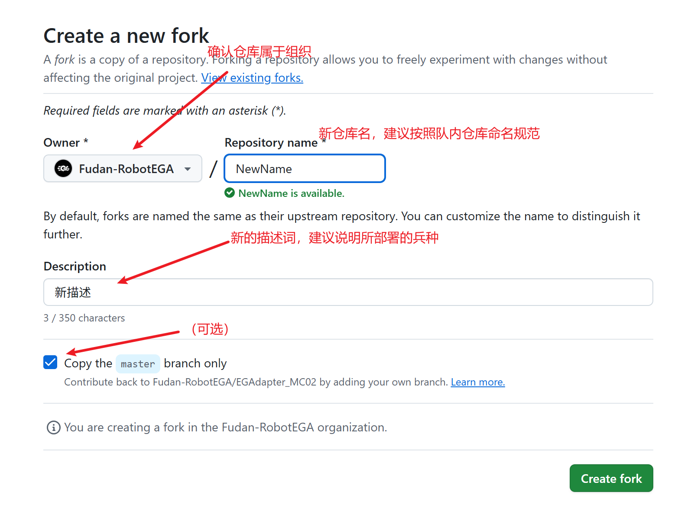
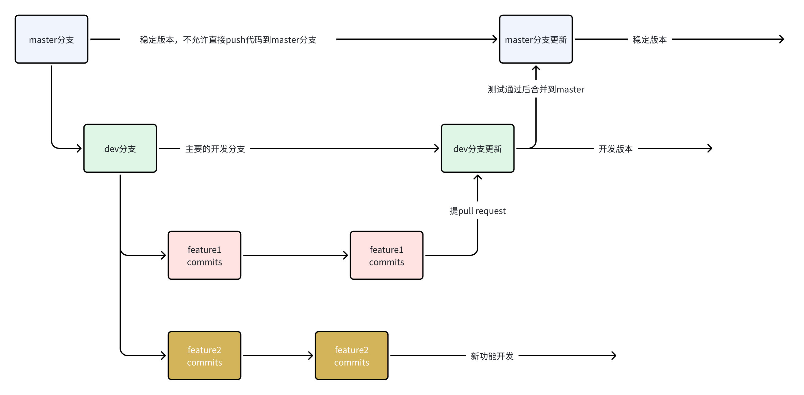

# EGAdapter_MC02电控框架

复旦大学星云EGA战队2026赛季新一代电控框架，基于达妙mc02开发板，具有高解耦性、快速适配、兼容云台底盘等特点。

  

## 项目简介

本项目迁移自湖南大学跃鹿战队的[basic_framework](https://github.com/HNUYueLuRM/basic_framework)及其移植版[basic_framework_mc02](https://gitee.com/hnuyuelurm/basic_framework_mc02)、C++版[powerful_framework](https://gitee.com/hnuyuelurm/powerful_framework)。在其基础上，配合星云EGA战队电控组的需求使用C++重写，并实现了一些新的特性。

框架名EGAdapter取自战队名星云EGA+适配器Adapter，也谐音“Easy Adapter”。我们希望该框架在部署到机器人上时，只做简单的修改便能适配新的硬件环境，从而节省重复造轮子的工作，避免一台机器人要搭配一个或数个电控写专门代码的情况。

相比战队2025赛季的老框架，新框架有以下特点：

* **层级划分更加明确**。
  * 框架将代码分为Driver层、Module层、Application层和Task层，相对老框架MCUdriver/Framework/Task层有了更明确的解耦划分。
  * Driver层是对STM32外设驱动的封装和对象化。将STM32的外设抽象为对象，同时重写了fdcan、usart等外设的回调函数，实现回调的独立化。Driver层将用户与HAL库隔离开，避免直接操作HAL库函数。后续迁移到其它开发板时，也只需要修改Driver层即可完成适配。
  * Module层是对电机、控制器、遥控器等模块的封装。各个模块将其所用到的外设实例和状态变量封装进class内部，通过指定的接口调用，实现了更安全的数据管理和更开箱即用的调用方式。Module层封装的模块更像是一块块积木，只要取出合适的积木并稍加拼装，就可以完成系统的构建
  * Application层是应用层/业务层。这一层是实现整车控制逻辑的主要区域，针对具体机器人的适配工作将主要在这一层实现。也就是说**调车绝大多数时间应该是修改Application层而不是去和硬件外设打交道**。
  * Task层是实际运行在FreeRTOS中的任务，包括一个task_manager和数个任务，不同任务有不同的控制周期。Application层所编写的对象将在Task层被实例化和调用。
* **参数化设计**。所有的对象都具有一个Config结构体，该结构体定义了这个对象生成所需的所有参数，用户可以方便地找到所有可调参数。
* **多态特性的运用**。框架为电机、控制器、imu模块设计了多态特性，通过一个基类提供统一的接口，多个派生类分别各自实现，从而使上层App完全不需要在乎具体的电机型号/控制模式/imu型号。
* **同时兼容云台和底盘**。在老框架中，云台和底盘的代码分居两个仓库，二者关联不大，需要两边的人分开维护，协作调车。在该框架下，云台和底盘板的区别仅仅体现为Application层中实例的选择性调用，无论是整车单板，还是作为云台或底盘板，其区别就只有实例化了哪些App而已。

新框架目前**仍在开发中**，很多隐形bug和安全机制的完善需要战队的大家共同参与！

## 使用指南

如果你需要为一台新机器人适配代码，请在Github组织内**fork出一个新的仓库**，避免与框架仓库混用。也不要在框架仓库里新建分支。

fork功能将把目前的仓库复制一份，作为新的仓库。且框架仓库有更新时，fork出来的分叉仓库可以获取上游仓库的变更，合并到本地仓库中。通过fork功能，不同的电控成员可以独立工作，且自行决定是否从上游获取新功能，也不需要担心自己的操作会意外搞坏上游仓库。

## 开发指南

如果你是本仓库的开发人员，请遵守开发规范。如有问题，请在飞书-达妙开发板框架小组群聊中提出。

### 分支设置

1. master：稳定分支
2. dev：开发分支，新功能都合并到dev分支上进行测试，没问题的话合并到master上
3. feature分支：开发各个功能的分支，每个分支由一个人负责，写好了感觉没问题的话在github页面提出pull request并告知项目负责人，然后由项目负责人合到dev分支上进行测试。记得经常fetch&pull！

### 项目结构说明

To be done...

## 联系方式

复旦大学星云EGA战队邮箱：fduxyega@163.com

项目负责人邮箱：zhangan2020@outlook.com

项目负责人QQ：892961012
